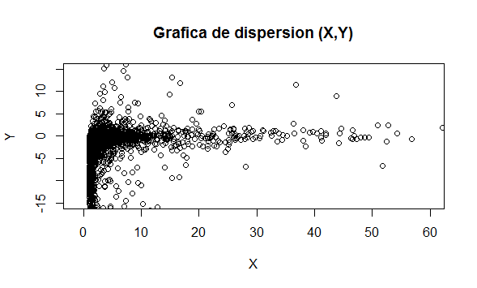

# Temas Selectos de Probabilidad y Estadística

# Segundo Examen Parcial

### 1. 16 de marzo
Analizar la deducción de la cópula subyacente en el Ejemplo 3.3 del libro de Nelsen y calcular en función del parámetro de dicha cópula las medidas de dependencia de Schweizer-Wolff, Hoeffding y distancia supremo, así como las medidas de concordancia de Kendall, Spearman y Erdely. Luego graficar juntas todas las medidas de dependencia y concordancia como funciones del parámetro.

```R
#Cargar librería "cubature" para integrar
install.packages("cubature")
library(cubature)
```

Medida de dependencia Schweizer-Wolff:
```R
Medida1<-function(a)
{
  SW<-function(x) 
    {
      if(0<=x[1] && x<=a*x[2] && a*x[2]<=a) C<-x[1]
      if(0<=a*x[2] && a*x[2]<x[1] && x[1]<1-(1-a)*x[2]) C<-a*x[2]
      if(a<=1-(1-a)*x[2] && 1-(1-a)*x[2]<=x[1] && x[1]<=1) C<-x[1]+x[2]-1
      abs(C-x[1]*x[2])
    }

  12*adaptIntegrate(SW, lowerLimit = c(0, 0), upperLimit = c(1, 1),maxEval=500)$integral
}

Medida1a<-Vectorize(Medida1)
curve(Medida1a,0,1,xname="SW",xlab="Medida de dependencia Schweizer-Wolff")
```


Medida de dependencia Hoeffding:
```R

Medida2<-function(a)
{ 
  Hoeffding<-function(x) 
    {
      if(0<=x[1] && x[1]<=a*x[2] && a*x[2]<=a) C<-x[1]
      if(0<=a*x[2] && a*x[2]<x[1] && x[1]<1-(1-a)*x[2]) C<-a*x[2]
      if(a<=1-(1-a)*x[2] && 1-(1-a)*x[2]<=x[1] && x[1]<=1) C<-x[1]+x[2]-1
      (C-x[1]*x[2])^2
    }
  
  sqrt(90*adaptIntegrate(Hoeffding, lowerLimit = c(0, 0), upperLimit = c(1, 1),maxEval=500)$integral)
}

Medida2a<-Vectorize(Medida2)
curve(Medida2a,0,1,xname="H",xlab="Medida de dependencia Hoeffding")
```


Medida de dependencia distancia supremo:
```R
linea <- seq(0,1,.005)
cop <- matrix(nrow = length(linea), ncol=length(linea))

Medida3 <- function(p){
  
  Supremo <- function(x,y,a)
  {
    if(x<=a*y) C <- x
    if(a*y< x && x< 1-(1-a)*y) C <- a*y
    if(1-(1-a)*y <= x ) C <- x+y-1
    C
  }
  
  for(j in 1:length(linea)) cop[j,] <- sapply(linea, Supremo, x=linea[j], a=p)
  
  4*max(abs(cop-outer(linea,linea)))
}

Medida3a<-Vectorize(Medida3)
curve(Medida3a,0,1,n=300,xname="Sup",xlab="Medida de dependencia Supremo")
```


Medida de concordancia de Kendall:
```R
#Concordancia1
Concordancia1<-function(a)
{
  Kendall<-function(x) 
  {
    1*(a<=1-(1-a)*x[2])*(1-(1-a)*x[2]<=x[1])*(x[1]<=1)
  }
  1-4*adaptIntegrate(Kendall, lowerLimit = c(0, 0), upperLimit = c(1, 1),maxEval=1000)$integral
}

Concordancia1a<-Vectorize(Concordancia1)
curve(Concordancia1a,0,1,xname="K",xlab="Medida de concordancia Kendall")
```


Medida de concordancia de Spearman:
```R
Concordancia2<-function(a)
{
  Sp<-function(x) 
  {
    if(0<=x[1] && x<=a*x[2] && a*x[2]<=a) C<-x[1]
    if(0<=a*x[2] && a*x[2]<x[1] && x[1]<1-(1-a)*x[2]) C<-a*x[2]
    if(a<=1-(1-a)*x[2] && 1-(1-a)*x[2]<=x[1] && x[1]<=1) C<-x[1]+x[2]-1
    C-x[1]*x[2]
  }

  12*adaptIntegrate(Sp, lowerLimit = c(0, 0), upperLimit = c(1, 1),maxEval=500)$integral
}

Concordancia2a<-Vectorize(Concordancia2)
curve(Concordancia2a,0,1,xname="Sp",xlab="Medida de concordancia Spearman")
```


Medida de concordancia de Erdely:
```R
linea <- seq(0,1,.01)
cop <- matrix(nrow = length(linea), ncol=length(linea))

Concordancia3 <- function(p)
{
  Erdely <- function(x,y,a)
    {
      if(x<=a*y) C <- x
      if(a*y< x && x< 1-(1-a)*y) C <- a*y
      if(1-(1-a)*y <= x ) C <- x+y-1
      C
    }
    
  for(j in 1:length(linea)) cop[j,] <- sapply(linea, Erdely, x=linea[j], a=p)
  
  4*(max(cop-outer(linea,linea))-max(outer(linea,linea)-cop))
}

Concordancia3a<-Vectorize(Concordancia3)
curve(Concordancia3a,0,1,xname="Er",xlab="Medida de concordancia Erdely")

```


### 2. 17 de marzo
Considere un vector aleatorio (X,Y) con función de densidad conjunta de probabilidades del Ejemplo 1.7 de las notas sobre vectores aleatorios. Programando en R:
```R
#Función de distribución conjunta FXY
Fxy <- function(x,y){
  if (x<Inf && y<Inf){
    z <- (1- exp(-x) - x*exp(-y))*(0<x)*(x<y) +
      (1- exp(-y) - y*exp(-y))*(0<y)*(y<=x)
  }
  if (x==Inf && y<Inf){
    z <- (1- exp(-y) - y*exp(-y))*(0<y)
  }
  if (x<Inf && y==Inf){
    z <- (1-exp(-x))*(0<x)
  }
  if (x==Inf && y==Inf){
    z <- 1
  }
  z
}

#Inversa de la marginal de X.
fxi_inv <- function(x){
  if (x < 1){-log(1-x)}
  else {Inf}
}
```

a) Simule una muestra aleatoria de (X,Y) de tamaño n = 3000 y realice un gráfico de dispersión.
```R
ui<-runif(3000,0,1)
xi <- sapply(ui,fxi_inv)
vi<-runif(3000,0,1)
yi<-xi-log(1-vi)

plot(xi, yi)
```


b) Con los valores simulados de X obtenga un histograma en la escala adecuada para que encima grafique la densidad teórica marginal de X. Lo mismo para Y.

Histograma de X:
```R
hist(xi,freq=F,breaks=100)
curve(dexp(x,rate=1), from=min(xi), to=max(xi), add = T)
```


Histograma de Y:
```R
hist(yi,freq=F,breaks=100)
curve(dgamma(x,shape=2), from=min(yi), to=max(yi), add = T)
```


c) Obtenga gráficas de los conjuntos de nivel de la cópula subyacente C mediante las funciones contour e image.
```R
#Inversa de marginal de Y.
fyi_inv <- function(y)
{
  if (y < 1){
    uniroot(function(z){pgamma(z,2,1)-y},lower=0,upper=7)$root
  }
  else {Inf}
}

#Cópula subyacente
cop.sub <- function(x,y) Fxy(fxi_inv(x),fyi_inv(y))

H <- seq(0,1,length=50)
G <- seq(0,1,length=50)
I <- matrix(0,50,50)
for(i in 1:50){ I[,i] <- sapply(H,FUN=cop.sub, x=G[i])}
```

Curvas de nivel mediante contour:
```R
contour(H,G,I, main='Cópula subyacente', sub="Curvas de nivel",
        xlab='U', ylab='V', nlevels = 20)
```


Curvas de nivel mediante image:
```R
image(H,G,I, main='Cópula subyacente', sub="Curvas de nivel",
      xlab='U', ylab='V', col = heat.colors(20))
```


d) Igual que en el inciso anterior pero de C(u,v) - uv.
```R
#C(u,v) - uv
cop.dif <- function(x,y) cop.sub(x,y)-x*y

H <- seq(0,1,length=50)
G <- seq(0,1,length=50)
I <- matrix(0,50,50)
for(i in 1:50){ I[,i] <- sapply(H,FUN=cop.dif, x=G[i])}
```

Curvas de nivel mediante contour:
```R
contour(H,G,I, main='C(u,v) - uv', sub="Curvas de nivel",
        xlab='X', ylab='Y', nlevels = 20)
```


Curvas de nivel mediante image:
```R
image(H,G,I, main='C(u,v) - uv', sub="Curvas de nivel",
      xlab='X', ylab='Y', col = heat.colors(20))
```


e) Calcule las medidas de dependencia de Schweizer-Wolff, Hoeffding y distancia supremo, así como las medidas de concordancia de Kendall, Spearman y Erdely.
```R

linea <- seq(0,1,by=0.01)
cop <- matrix(0,length(linea),length(linea))

for(i in 1:length(linea))
{
  cop[,i] <- sapply(linea,FUN=cop.sub, x=linea[i])
}

## Schweizer-Wolff:
SW <- 12*sum(abs(cop-outer(linea,linea))*0.01^2)
SW
## Hoeffding:
H <- sqrt(90*sum((cop-outer(linea,linea))^2)*0.01^2)
H
## Distancia supremo:
DS <- 4*max(abs(cop-outer(linea,linea)))
DS

## Kendall:
concor<-sum(outer(xi,xi,function(x,y) x-y)*outer(yi,yi,function(x,y) x-y)>0)
discor<-sum(outer(xi,xi,function(x,y) x-y)*outer(yi,yi,function(x,y) x-y)<0)
K <- (concor-discor)/(concor+discor)
K
## Spearman:
S <- 12*sum(cop-outer(linea,linea))*0.01^2
S
## Erdely:
E <- 4*(max(cop-outer(linea,linea))-max(outer(linea,linea)-cop))
E
```

### 3. 25 de marzo
Simule una muestra aleatoria de tamaño n = 3000 a partir de un vector aleatorio (U,V) con marginales Uniformes(0,1) y cópula Clayton con parámetro 2. 
```R
#Copula Clayton
Clayton<-function(u,v)
{
  (max(u^(-2)+v^(-2)-1,0))^(-1/2)
}

#Distribución condicional Y|X=x
FYlx <-function(y,X=x)
{
  z <- 0
  if(0<x) z <- (Clayton(x,y)/X)
  z
}

#Funcion condicional inversa de Y|X=x
FYlx_inv <- function(z,X=x)
{
  uniroot(function(w) FYlx(w,X) - z,interval = c(0,1))$root
}

U <- runif(3000)
V <- runif(3000)
X <- U
Y <- vector(mode = "numeric", length = 3000)

for(i in 1:length(X))
{
  x <- X[i]
  Y[i] <- FYlx_inv(V[i])
}

```
Realice gráficas de histogramas marginales y uno de dispersión.

Distribución de X
```R
hist(X,probability = T)
```


Distribución de Y
```R
hist(Y,probability = T)
```


Dispersión (X,Y)
```R
plot(X,Y)
```


Calcule las medidas de dependencia de Schweizer-Wolff, Hoeffding y distancia supremo, así como las medidas de concordancia de Kendall, Spearman y Erdely.
```R
linea <- seq(0,1,.01)
cop <- matrix(nrow = length(linea), ncol = length(linea))
W <- matrix(nrow = length(linea), ncol = length(linea))

for(j in 1: length(linea))
{
  cop[j,] <- sapply(linea, Clayton, u=linea[j])
}

#Producto de las parciales de la copula Clayton
Clayton_der <- function(u,v)
{
  z <- 0
  if(0<u && 0<v)
    z <- max(0,(u^(-2)+v^(-2)-1)^(-3/2)*u^(-3))*max(0,(u^(-2)+v^(-2)-1)^(-3/2)*v^(-3))
  z
}

for(j in 1: length(linea))
{
  W[j,] <- sapply(linea, Clayton_der, u=linea[j])
}
```

Medida de dependencia Schweizer-Wolff:
```R
(SW <- 12*sum(abs(cop-outer(linea,linea)))*(.01^2))
```


Medida de dependencia Hoeffding:
```R
(Hoeffding <- sqrt(90*sum((cop-outer(linea,linea))^2)*(.01^2)))
```


Medida de dependencia distancia supremo:
```R
(Supremo <- 4*max(abs(cop-outer(linea,linea))))
```


Medida de concordancia de Kendall:
```R
(Kendall <- 1-4*sum(W)*(.01^2))
```


Medida de concordancia de Kendall Muestral:
```R
concor<-sum(outer(X,X,function(x,y) x-y)*outer(Y,Y,function(x,y) x-y)>0)
discor<-sum(outer(X,X,function(x,y) x-y)*outer(Y,Y,function(x,y) x-y)<0)
(Kendall.Muestral <- (concor-discor)/(concor+discor))
```


Medida de concordancia de Spearman:
```R
(Spearman <- 12*sum(cop-outer(linea,linea))*(.01^2))
```


Medida de concordancia de Erdely:
```R
(Erdely <- 4*(max(cop-outer(linea,linea))-max(outer(linea,linea)-cop)))
```


### 4. 25 de marzo
Lo mismo del ejercicio anterior pero para (X,Y) pero con distribuciones marginales X ~ Pareto(1,1), Y ~ Cauchy(0,1). 
```R
#Copula Clayton
Clayton <- function(u,v){
  (max(u^(-2)+v^(-2)-1,0)^(-1/2))*(0<u && u <=1)*(0<v && v <=1)
} 

#Funcion de distribucion de X
FX <- function(x){
  (1-1/x)*(1<=x)
}

FY <- function(y){
  pcauchy(y)
}

#Funcion de distribucion conjunta 
FXY <- function(x,y){
  Clayton(FX(x),FY(y))
}

#Distribución condicional Y|X=x
FY_X <- function(y,X=x){
  z <- 0
  if(FX(X)>0){
    z <- FXY(x,y)/FX(X)
  }
  z
}

#Funcion condicional inversa de Y|X=x
FY_X_inv <- function(y,X=x){
  z <- 0
  if(y>.02 && y<.99){
    z <- uniroot(function(w) FY_X(w,X) - y, lower =-1000/FX(X),upper = 1000/FX(X) )$root
  }
  if(y>.99){
    z <- 0
  }
  z
}

set.seed(0)
U <- runif(3000)
V <- runif(3000)

X <- 1/(1-U)
Y <- vector(mode = "numeric", length = 3000)

for(j in 1:length(U)){
  x <- X[j]
  Y[j] <- FY_X_inv(V[j])
}
```

Histograma de X
```R
hist(X,probability = T,breaks = 10000,xlim = c(-1,30))
```


Histograma de Y
```R
hist(Y, xlim = c(-15,15),breaks = 5000)
```


Grafica de dispersion
```R
plot(X,Y, xlim = c(-1,60),ylim = c(-15,15),main = "Grafica de dispersion (X,Y)")
```


Calcule las medidas de dependencia de Schweizer-Wolff, Hoeffding y distancia supremo, así como las medidas de concordancia de Kendall, Spearman y Erdely.
```R
linea <- seq(0,1,.01)
cop <- matrix(nrow = length(linea), ncol = length(linea))
W <- matrix(nrow = length(linea), ncol = length(linea))

for(j in 1:length(linea))
{
  cop[j,] <- sapply(linea, Clayton, u=linea[j])
}

#Producto de las parciales de la cópula Clayton
Clayton_der <- function(u,v)
{
  z <- 0
  if(0<u && 0<v)
    z <- max(0,(u^(-2)+v^(-2)-1)^(-3/2)*u^(-3))*max(0,(u^(-2)+v^(-2)-1)^(-3/2)*v^(-3))
  z
}

for(j in 1: length(linea))
{
  W[j,] <- sapply(linea, Clayton_der, u=linea[j])
}
```

Medida de dependencia Schweizer-Wolff:
```R
(SW <- 12*sum(abs(cop-outer(linea,linea)))*(.01^2))
```


Medida de dependencia Hoeffding:
```R
(Hoeffding <- sqrt(90*sum((cop-outer(linea,linea))^2)*(.01^2)))
```


Medida de dependencia distancia supremo:
```R
(Supremo <- 4*max(abs(cop-outer(linea,linea))))
```


Medida de concordancia de Kendall:
```R
(Kendall <- 1-4*sum(W)*(.01^2))
```


Medida de concordancia de Kendall Muestral:
```R
concor<-sum(outer(X,X,function(x,y) x-y)*outer(Y,Y,function(x,y) x-y)>0)
discor<-sum(outer(X,X,function(x,y) x-y)*outer(Y,Y,function(x,y) x-y)<0)
(Kendall.Muestral <- (concor-discor)/(concor+discor))
```


Medida de concordancia de Spearman:
```R
(Spearman <- 12*sum(cop-outer(linea,linea))*(.01^2))
```


Medida de concordancia de Erdely:
```R
(Erdely <- 4*(max(cop-outer(linea,linea))-max(outer(linea,linea)-cop)))
```

